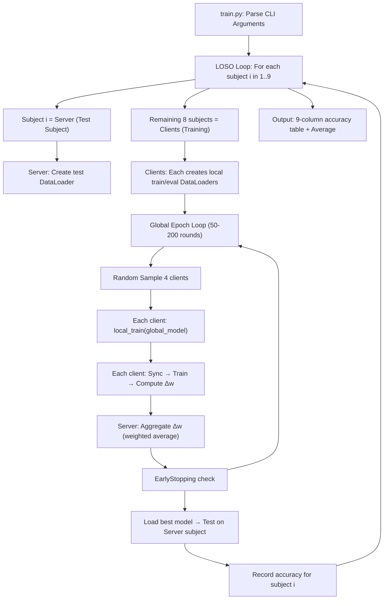

# FL-Cuda Codebase — Complete Analysis

> Prepared as the reference knowledge-base for writing an A-grade minor project report.

---

## 1. Repository Overview

| Item | Detail |
|---|---|
| **Paper** | *Federated Motor Imagery Classification for Privacy-Preserving Brain-Computer Interfaces* — Tianwang Jia et al. |
| **Domain** | Federated Learning (FL) × Brain-Computer Interfaces (BCI) |
| **Core Idea** | Train an EEG motor-imagery classifier across multiple subjects *without* sharing raw brain signals (privacy-preserving). |
| **Dataset** | BNCI2014001 (BCI Competition IV-2a) — 9 subjects, 4-class motor imagery, 22 EEG channels, 250 Hz |
| **Model** | EEGNet (compact CNN for EEG) |
| **FL Strategies** | FedAvg (baseline), FedProx (implicitly via same path), **FedBS** (novel contribution — SAM + BN-skip) |
| **Evaluation** | Leave-One-Subject-Out (LOSO): each of the 9 subjects takes a turn as the "server" (test), remaining 8 are "clients" (train) |
| **Tech Stack** | Python, PyTorch, CUDA, scipy, mne, moabb, scikit-learn, Docker |

---

## 2. File-by-File Walkthrough

### 2.1 `src/model.py` — EEGNet Architecture (67 lines)

```
Purpose: Defines the neural network used by both server and every client.
```

**Architecture (3 sequential blocks + classifier):**

| Block | Layers | Purpose |
|---|---|---|
| **Block 1 — Temporal Filter** | ZeroPad2d → Conv2d(1, F1=8, kernel=(1, 125)) → BatchNorm2d | Learns frequency-domain filters across the time axis. Kernel size = `sample_rate/2 = 125` captures ~2 Hz resolution. |
| **Block 2 — Spatial Filter** | Conv2d(F1, D×F1=16, kernel=(22, 1), groups=F1) → BN → ELU → AvgPool(1,4) → Dropout | Depthwise convolution across all 22 channels. Each temporal filter gets `D=2` spatial maps. |
| **Block 3 — Separable Conv** | ZeroPad2d → DepthwiseConv(16, 16, kernel=(1, 31)) → PointwiseConv(16, F2=16, kernel=(1,1)) → BN → ELU → AvgPool(1,8) → Dropout | Separable convolution for efficient feature extraction with fewer parameters. |
| **Classifier** | Linear(F2 × (time//32), 4) | Flattens and classifies into 4 motor imagery classes: left hand, right hand, feet, tongue. |

**Key design choices:**
- `bn_track` parameter: When `FedBS=True`, BatchNorm tracking is **disabled** (`track_running_stats=False`). This is critical — FedBS deliberately forces each client to use *only* mini-batch statistics, preventing running-mean/running-var from being influenced by the global model's aggregated stats.
- `MaxNormConstraint()`: Clips spatial filter weights to L2-norm ≤ 1.0 and classifier weights to ≤ 0.25. This is an EEGNet-specific regularization from the original paper.
- Input shape: `(batch, 1, 22, 1001)` → channels=22 EEG electrodes, time=1001 samples (≈4s at 250 Hz).

---

### 2.2 `src/SAM.py` — Sharpness-Aware Minimization (51 lines)

```
Purpose: The SECRET WEAPON of FedBS. Replaces standard SGD with a two-step optimizer
         that finds FLAT minima instead of sharp ones.
```

**Algorithm (2-step process each mini-batch):**

```
Step 1 — ASCENT: Perturb weights to find the worst-case loss in a ρ-neighborhood
    ε = ρ × (gradient / ||gradient||₂)     # Normalized gradient scaled by rho
    θ̃ = θ + ε                                # Temporarily move TO the sharpest point

Step 2 — DESCENT: Compute gradient at the perturbed point, then apply SGD at the ORIGINAL point
    θ̃ = θ̃ - ε                                # Undo the perturbation (back to θ)
    θ = θ - lr × ∇L(θ̃)                       # Standard SGD step using the "worst-case" gradient
```

**Why this matters for FL:**
- In FL, each client's local data is small and non-IID. Standard SGD tends to find **sharp minima** that only work well for that specific client's data.
- SAM forces the optimizer to find **flat minima** — solutions that are robust to perturbations. These generalize better across all clients when aggregated at the server.
- The `rho` hyperparameter (default 0.1) controls the perturbation radius. Larger ρ = flatter minima but slower convergence.

**Implementation details:**
- Uses `defaultdict(dict)` to cache epsilon tensors per parameter (avoids repeated memory allocation).
- `@torch.no_grad()` decorator on both steps since we're manually manipulating weights.
- Gradient norm has `+ 1e-16` for numerical stability.

---

### 2.3 `src/client.py` — Federated Client (94 lines)

```
Purpose: Each subject (except the test subject) becomes a Client that trains a local copy
         of the global model on its own EEG data.
```

**`__init__` — Client Initialization:**
- Creates a local copy of EEGNet on the available device (CUDA/CPU).
- Applies Xavier initialization via `weights_init()`.
- Creates DataLoaders for train and eval datasets.
- If `fedbs=True`: BatchNorm tracking is disabled (`bn_track=False`).

**`local_train(global_model)` — The core FL training step:**

```python
# Step 1: Sync with global model
for name, param in global_model.state_dict().items():
    if self.args.fedbs and 'bn' in name:
        continue  # ← FedBS KEY INNOVATION: Skip BatchNorm layers!
    self.local_model.state_dict()[name].copy_(param.clone())
```

> [!IMPORTANT]
> **FedBS skips syncing BatchNorm parameters.** In standard FedAvg, the server sends ALL parameters (including BN running_mean/running_var) to clients. FedBS deliberately lets each client maintain its **own** BatchNorm statistics, because EEG data distributions vary dramatically across subjects (brain signals are highly individual).

```python
# Step 2: Local training loop
for epoch in range(local_epochs):
    for X, y in train_dataloader:
        if fedbs:
            # Two-pass SAM optimization
            loss1.backward()        # Compute gradient
            minimizer.ascent_step() # Perturb weights to worst-case
            loss2.backward()        # Compute gradient at perturbed point
            minimizer.descent_step()# Step back and apply SGD
        else:
            # Standard FedAvg SGD
            loss.backward()
            optimizer.step()
```

```python
# Step 3: Compute weight diff (Δw = w_local - w_global) and return to server
weight_diff[name] = local_model[name] - global_model[name]
```

**`local_eval(global_model)` — Evaluation:**
- Fully syncs local model with global model (including BN for eval).
- Runs forward pass on eval data, computes loss and accuracy.
- Labels are one-hot encoded → uses `y.max(1)[1]` to get class index.

---

### 2.4 `src/server.py` — Federated Server (62 lines)

```
Purpose: Holds the global model, aggregates client updates, and tests the final model.
```

**`__init__`:**
- Creates the global EEGNet model (same architecture as clients).
- Creates a DataLoader for the test subject's data (batch_size=8, no shuffle).

**`model_aggregate(client_weight_dict, avg_weight_dict, candidates_id_list)` — FedAvg Aggregation:**

```python
for each candidate client:
    for each layer:
        update = client_weight_diff × avg_weight   # Weighted contribution
        global_model[layer] += update                # In-place addition
```

- `avg_weight_dict`: In this implementation, all clients get **equal weight** (`1/N`).
- Handles type mismatch: BatchNorm's `num_batches_tracked` is `int64`, but weight diffs are `float32`. The code explicitly casts to prevent PyTorch crashes.

**`model_test()` — Final evaluation on held-out subject:**
- Standard eval loop, returns test loss and accuracy.
- This accuracy is what goes into the LOSO results table.

---

### 2.5 `src/datasets.py` — Data Loading Pipeline (108 lines)

```
Purpose: Loads .mat files containing preprocessed EEG motor imagery data and applies
         transforms.
```

**Data source:** BNCI2014001 (BCI Competition IV Dataset 2a)
- 9 subjects, each performing 4 motor imagery tasks
- 22 EEG channels, sampled at 250 Hz, ~4s trials → 1001 time points
- Data stored as `.mat` files (MATLAB format): `{subject_id}.mat` containing `X` (trials × channels × time) and `y` (labels)

**Transforms (applied in order):**

| Transform | Description |
|---|---|
| `EA` (Euclidean Alignment) | Aligns EEG covariance matrices across sessions/subjects using `R⁻⁰·⁵ × X`. This is a domain adaptation technique that reduces inter-subject variability. Uses `scipy.linalg.fractional_matrix_power`. |
| `ZScoreNorm` | Channel-wise z-score normalization (defined but not used by default). |
| `ArrayToTensor` | Converts numpy arrays to `torch.FloatTensor`. |

**`MIDataset` class:**
- Loads data for specified subject IDs from `.mat` files.
- One-hot encodes labels using `pd.get_dummies()`.
- Supports `BNCI2015001` by trimming to 400 trials.
- Reshapes data to `(N, 1, C, T)` for Conv2d input.
- Splits into train/val (80/20) via `train_test_split`.
- Mode selector: `'train'`, `'val'`, or `'all'` (shuffled full dataset).

---

### 2.6 `src/utils.py` — Utilities (64 lines)

**`weights_init(m)`:**
- Conv2d: Xavier Normal initialization
- BatchNorm2d: Normal(mean=1.0, std=0.02) for weight, Constant(0.0) for bias
- Linear: Xavier Normal initialization

**`EarlyStopping`:**
- Monitors validation loss; stops training if no improvement for `patience` epochs.
- When `early=False` (default): Simply saves the model at the **last epoch** (no early stopping logic).
- When `early=True`: Tracks best score, increments counter on no improvement, triggers `early_stop=True` after patience is exhausted.
- Saves the best model checkpoint to disk via `torch.save()`.

---

### 2.7 `src/train.py` — Main Training Orchestrator (172 lines)

```
Purpose: The entry point. Parses arguments, runs the complete LOSO federated training loop,
         and outputs the results table.
```

**Complete Data Flow:**



**CLI Arguments (Key ones):**

| Argument | Default | Purpose |
|---|---|---|
| `--model` | `eegnet` | Model architecture |
| `--global_epochs` | 200 | Number of FL communication rounds |
| `--local_epochs` | 2 | Training epochs per client per round |
| `--sample_num` | 4 | Clients randomly sampled per round |
| `--batch_size` | 32 | Mini-batch size |
| `--lr` | 0.005 | Learning rate |
| `--fedbs` | False | Enable FedBS (SAM + BN-skip) |
| `--rho` | 0.1 | SAM perturbation radius |
| `--data_path` | `./data/BNCI2014001` | Path to .mat data files |
| `--sub_id` | `1,2,3,4,5,6,7,8,9` | Subject IDs to include |

**LOSO Loop (Leave-One-Subject-Out):**
```
For each subject i ∈ {1,2,...,9}:
    Server = Subject i (test data only)
    Clients = {1,...,9} \ {i} (training data)
    Run federated training → Record test accuracy for subject i
Final output: Table of 9 accuracies + average
```

---

## 3. Algorithm Comparison — What the Report Needs

### 3.1 FedAvg (Baseline)

```
1. Server initializes global model
2. For each round:
   a. Server sends global model to sampled clients
   b. Each client trains locally with standard SGD
   c. Each client sends weight difference (Δw) back
   d. Server averages: w_global += (1/N) × Σ Δw_i
```

- **In codebase:** `--fedbs False` (default). Uses plain `SGD(lr=0.005, momentum=0.9, weight_decay=1e-4)`.
- **Weakness for BCI:** Assumes IID data. EEG signals are highly non-IID across subjects (everyone's brain is different).

### 3.2 FedProx

```
Same as FedAvg, but adds a proximal term:
L_total = L_task + (μ/2) × ||w_local - w_global||²
```

> [!NOTE]
> **Important implementation note:** Looking at the codebase, FedProx is mentioned in the README (`--fedprox True`) but there is **no `--fedprox` argument** defined in `argparse` and **no proximal term** implemented in `client.py`. The README describes it as a concept, but the current code does not actually implement FedProx differently from FedAvg. For the report, you should either implement it or describe FedAvg results as the non-FedBS baseline.

### 3.3 FedBS (Novel Contribution)

FedBS = **Fed**erated **B**atch-norm **S**harpness — two synergistic innovations:

**Innovation 1: BatchNorm Skip (the "B")**
- During global → local sync, **skip BatchNorm parameters** (`running_mean`, `running_var`, `weight`, `bias`).
- Each client maintains its **own** BN statistics that adapt to its subject-specific EEG distribution.
- During aggregation, BN parameters are still included in the weight diff, so the server model gets a form of averaged BN stats.
- `track_running_stats=False` means BN always uses mini-batch statistics, never accumulated running stats.

**Innovation 2: SAM Optimizer (the "S")**
- Replaces SGD with Sharpness-Aware Minimization.
- Forces local models to converge to **flat minima** that generalize better across subjects.
- Two forward passes per batch (compute cost ~2× FedAvg per local step).

```
FedBS Pseudocode:
1. Server initializes global model with bn_track=False
2. For each round:
   a. Server sends model (EXCEPT BN params) to sampled clients
   b. Each client trains with SAM optimizer:
      - Forward pass → compute loss → backward pass
      - Ascent step: perturb weights toward worst-case
      - Forward pass again → backward pass
      - Descent step: undo perturbation, apply SGD
   c. Client sends full weight diff (including BN) back
   d. Server aggregates with weighted average
```

---

## 4. Mapping to Report Sections

### Section 1: Problem Definition and Objectives (1-2 pages)

**The Gap:** Traditional centralized BCI training requires pooling raw EEG data from all subjects → privacy violation. FL solves data sharing, but standard FL (FedAvg) fails for BCI because:
1. EEG data is extremely non-IID (each brain is unique)
2. Sharp local minima don't generalize across subjects
3. Shared BatchNorm statistics corrupt individual subject distributions

**Quantifiable Objectives:**
- Achieve competitive 4-class motor imagery classification accuracy (≥70% average across 9 subjects)
- Maintain data privacy (zero raw data sharing between subjects)
- Outperform FedAvg baseline by leveraging subject-specific BN and SAM

### Section 2: Proposed Methodology and Architecture Diagrams (2-5 pages)

**Diagrams needed:**
1. **System Architecture:** Server ↔ Client communication with LOSO rotation
2. **EEGNet Block Diagram:** Input(1×22×1001) → Block1 → Block2 → Block3 → FC → 4 classes
3. **FedBS vs FedAvg Data Flow:** Highlight BN-skip and SAM differences
4. **SAM Optimization Landscape:** Show flat vs. sharp minima conceptually

### Section 3: Algorithm and Implementation (6-12 pages)

**Pseudocode needed for:**
1. LOSO cross-validation loop
2. FedAvg aggregation
3. FedBS local training (SAM + BN skip)
4. EEGNet forward pass
5. Euclidean Alignment preprocessing

**Environment specifics:**
| Component | Version |
|---|---|
| Base Image | `pytorch/pytorch:1.11.0-cuda11.3-cudnn8-runtime` |
| Python | 3.x (from Docker image) |
| PyTorch | 1.11.0 |
| CUDA | 11.3 |
| Key Libraries | scipy, scikit-learn, mne, moabb, pandas, matplotlib |
| Hardware | NVIDIA GPU with CUDA support (specify your actual GPU) |

### Section 4: Results and Comparative Analysis (5-10 pages)

**Experiments to run and compare:**

| Experiment | Command |
|---|---|
| FedAvg (baseline) | `python src/train.py --model eegnet --global_epochs 50 --local_epochs 2 --data_path "..." ` |
| FedBS (proposed) | `python src/train.py --model eegnet --global_epochs 50 --local_epochs 2 --data_path "..." --fedbs True --rho 0.1` |

**Metrics to report:**
1. Per-subject test accuracy (9 subjects) — bar chart
2. Average accuracy comparison — table
3. Training loss convergence curves — line plot (needs TensorBoard or logging modification)
4. Computational overhead: FedBS does 2× forward passes per batch (SAM)

**Existing training runs found:**
- `20260423_165729/` — Complete run (9 subject models saved, ~22KB each)
- Multiple earlier partial runs available

---

## 5. Key Technical Insights for the Report

### Why FedBS works better for BCI (sell this to evaluators):

1. **Brain signals are the ultimate non-IID data.** No two brains produce the same EEG patterns for the same motor imagery task. FedAvg's assumption of homogeneous data distributions is fundamentally violated.

2. **BatchNorm is the silent killer in FL for BCI.** Standard BN accumulates running statistics. When the server averages BN stats from 8 subjects with wildly different EEG distributions, the resulting "average brain" statistics are meaningless. FedBS solves this by letting each client keep its own BN stats.

3. **Sharp minima = memorization of one subject.** With only ~288 trials per subject, local SGD quickly overfits to that subject's specific EEG patterns. SAM's flat minima are inherently more transferable across subjects.

4. **The two innovations are synergistic.** BN-skip prevents distribution corruption at the normalization level. SAM prevents overfitting at the optimization level. Together, they produce a global model that adapts well to *any* subject's data during testing.

### Limitations to address honestly:

1. **2× computational cost** per local training step (SAM requires two forward+backward passes).
2. **Hyperparameter sensitivity:** `rho` must be tuned. Too large → underfitting; too small → no benefit.
3. **Small dataset:** Only 9 subjects. Statistical significance is limited.
4. **No differential privacy guarantees:** FL prevents raw data sharing, but weight updates can still leak information via gradient inversion attacks.
5. **Equal client weighting:** The `avg_weight_dict` gives all clients `1/N` weight regardless of data quality or quantity.

---

## 6. Data Flow Summary (End-to-End)

```
Raw .mat files (per subject)
    ↓
MIDataset: Load X(trials×22×1001), y(labels)
    ↓
Euclidean Alignment: R⁻⁰·⁵ × X (reduces cross-subject variance)
    ↓
ArrayToTensor: numpy → torch.FloatTensor
    ↓
Reshape: (N, 1, 22, 1001) for Conv2d
    ↓
One-hot encode labels via pd.get_dummies
    ↓
DataLoader(batch_size=32, shuffle=True for train)
    ↓
EEGNet: Block1(temporal) → Block2(spatial) → Block3(separable) → FC(4 classes)
    ↓
CrossEntropyLoss → SGD or SAM optimization
    ↓
Weight diff (Δw) → Server aggregation → Updated global model
    ↓
Repeat for 50 global epochs
    ↓
Test on held-out subject → Record accuracy
```
